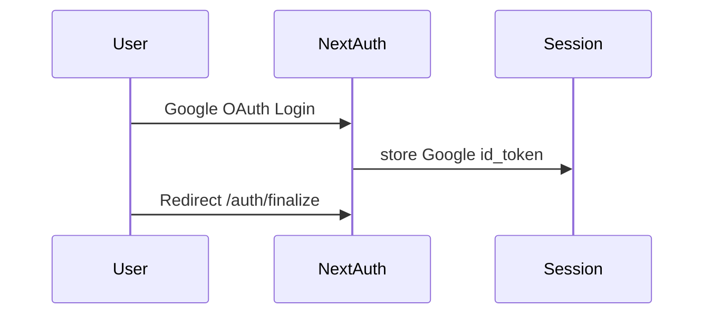

# 🔐 Auth Flow – Google Login → NextAuth → Sigbang API

## Overview

이 문서는 Google OAuth 로그인부터 NextAuth 세션 관리,  
백엔드 토큰 교환, 프록시 인증 검증, 쿠키 정책, 로그아웃 처리까지의  
전체 인증 시퀀스를 설명합니다.

---

## 1. Google 로그인 → NextAuth 세션

### Flow
1. 사용자가 **Google OAuth 로그인** 수행  
2. `NextAuth`의 `jwt/session` 콜백에서 **Google id_token**을 세션에 포함  
3. 로그인 완료 후 클라이언트는 `/auth/finalize`로 이동  
4. 세션의 `id_token`을 이용해 **토큰 교환** 단계로 진입



---

## 2. 토큰 교환 (/api/auth/google)

### Flow
- 클라이언트는 `id_token` + `deviceId/deviceName`을 `/api/auth/google`에 POST  
- 서버가 **백엔드 `/auth/google`**에 요청  
- 응답으로 받은 `accessToken` / `refreshToken`을 파싱  
- 다음과 같이 httpOnly 쿠키로 저장:
  - `sb_at`: Access Token (exp 기반 만료)
  - `sb_rt`: Refresh Token (30일 유효)

```bash
POST /api/auth/google
body: {
  id_token: "<google_id_token>",
  deviceId: "<device_uuid>",
  deviceName: "<device_label>"
}
```

| 쿠키 | 설명 | 속성 | 만료 |
|------|------|------|------|
| `sb_at` | Access Token | httpOnly | JWT `exp` (기본 1시간) |
| `sb_rt` | Refresh Token | httpOnly | 30일 |
| `sb_did` | 디바이스 식별용 | 일반 쿠키 | 필요 시 서버 전송 |

---

## 3. 일반 요청 흐름 (/api/proxy 경유)

### ensureAtBeforeRequest

- 모든 요청 전 **`sb_at` 만료 여부 확인**
- 만료 또는 부재 시 `sb_rt`로 **리프레시 시도**
- 유효한 AT를 `Authorization: Bearer`로 백엔드에 전달

### 401 Handling

- 백엔드 응답이 `401`일 경우:
  1. 한 번 리프레시 후 재시도  
  2. 재시도 실패 시 쿠키 삭제  
  3. 응답 헤더 `x-auth-status: invalid` 설정

```js
// Pseudocode
if (isAtExpired()) {
  refreshWithRt();
}
setHeader('Authorization', `Bearer ${sb_at}`);
if (response.status === 401) {
  attemptRefreshOnce();
  if (fail) clearCookies();
}
```

---

## 4. 클라이언트 유지 / 복구 로직

### Lifecycle
- **탭 활성화 시** → `GET /api/proxy/users/me` 호출  
  → 서버측 리프레시 로직 트리거  

### Axios Interceptors
- **Request 인터셉터**
  - `sb_at` 부재 또는 60초 내 만료 예정 → 리프레시 시도
- **Response 인터셉터**
  - `401` 또는 `x-auth-status: invalid` → `/login`으로 리다이렉트

```js
axios.interceptors.request.use(async (config) => {
  if (shouldRefreshSoon()) await refreshTokens();
  return config;
});

axios.interceptors.response.use(null, (error) => {
  if (isUnauthorized(error)) redirectToLogin();
});
```

---

## 5. 로그아웃 (/api/auth/logout)

### Flow
1. `/api/auth/logout` 호출  
2. 서버가 `sb_rt`를 **백엔드 `/auth/signout`**에 전달  
3. `sb_at`, `sb_rt` 쿠키 삭제 후 세션 종료

```bash
POST /api/auth/logout
↓
/auth/signout (with sb_rt)
↓
clearCookies(sb_at, sb_rt)
```

---

## 6. 검증 포인트

| 항목 | 검증 내용 |
|------|------------|
| 요청 인증 | 모든 요청마다 `sb_at` 만료 여부 확인 및 자동 리프레시 |
| 실패 처리 | 백엔드 `401` 응답 시 1회 리프레시 후 재시도 → 실패 시 쿠키 삭제 및 `x-auth-status: invalid` |
| 보안 정책 | 모든 주요 토큰은 `httpOnly` 쿠키로 저장, `sb_rt`는 장기 보관 (30일), `sb_at`은 짧은 주기 만료 |

---

## 7. 쿠키 / 토큰 정책 요약

| 이름 | 용도 | 속성 | 만료 | 비고 |
|------|------|------|------|------|
| **sb_at** | Access Token | `httpOnly` | `exp` 또는 1시간 | 매 요청마다 검증 |
| **sb_rt** | Refresh Token | `httpOnly` | 30일 | 재발급 전용 |
| **sb_did** | Device ID | 클라이언트 | 세션 유지용 | 서버 리프레시에 포함 가능 |

---

## Diagram Summary

```mermaid
flowchart LR
A[Google OAuth Login] --> B[NextAuth Session (id_token)]
B --> C[/auth/finalize]
C --> D[/api/auth/google → Backend /auth/google]
D --> E[Set-Cookie sb_at/sb_rt]
E --> F[/api/proxy Request]
F --> G[ensureAtBeforeRequest → refresh if expired]
G --> H[Backend API]
H -->|401| I[Refresh once → clear cookies if fail]
I --> J[Client redirect /login]
```
